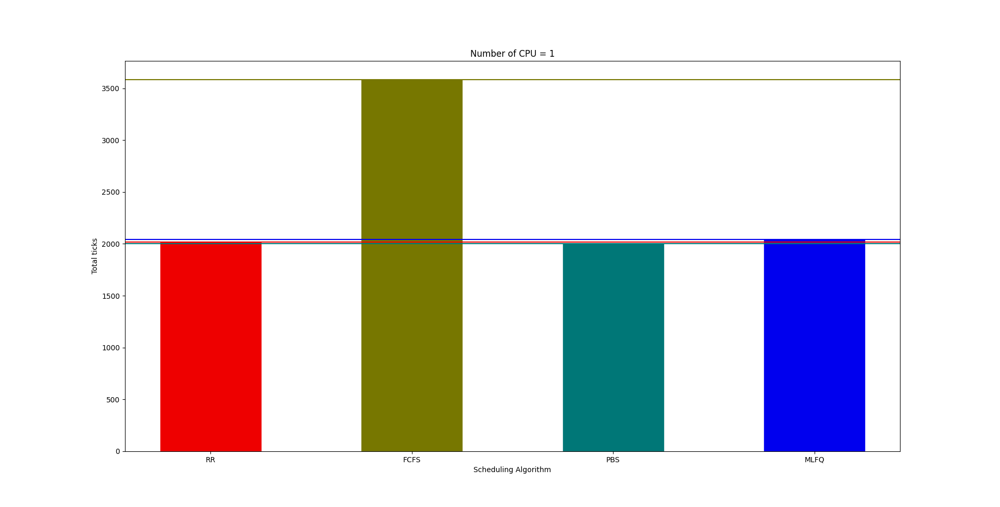
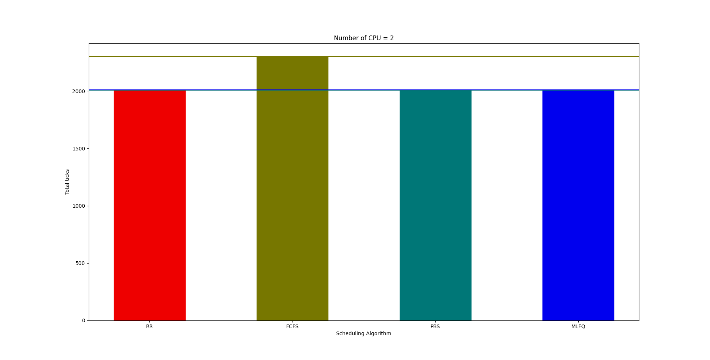
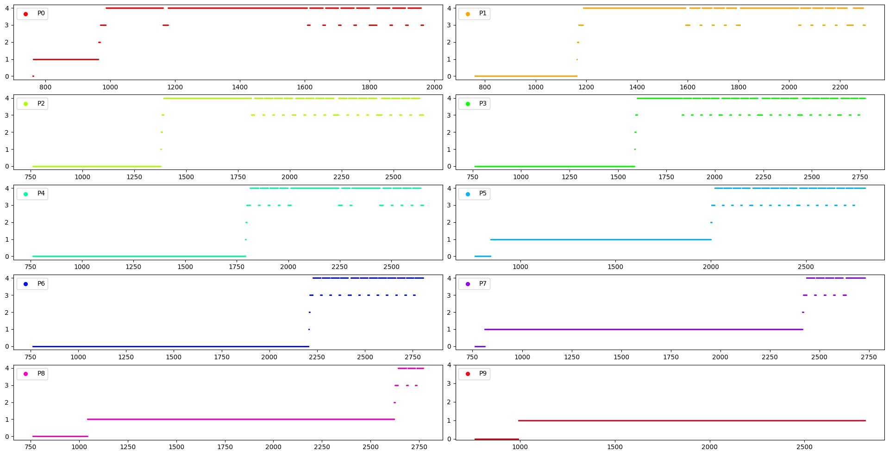
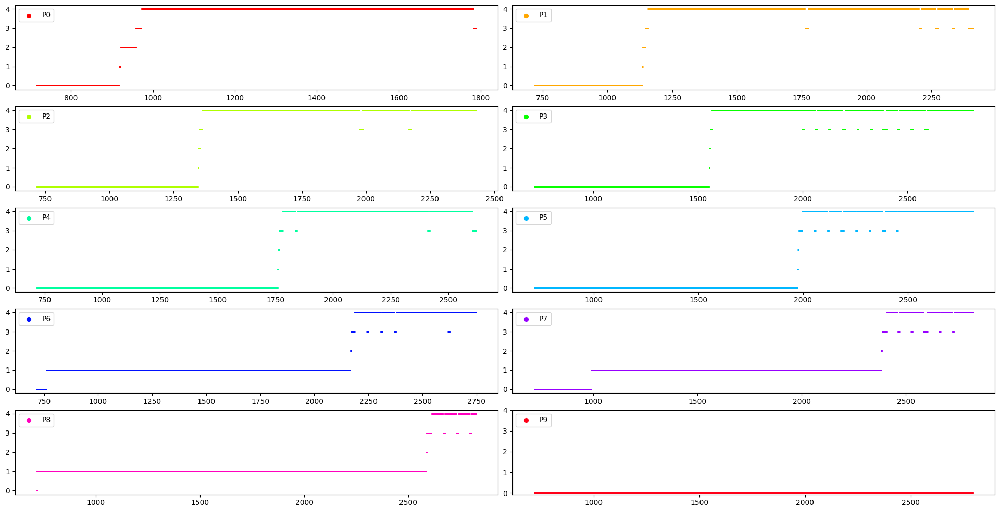
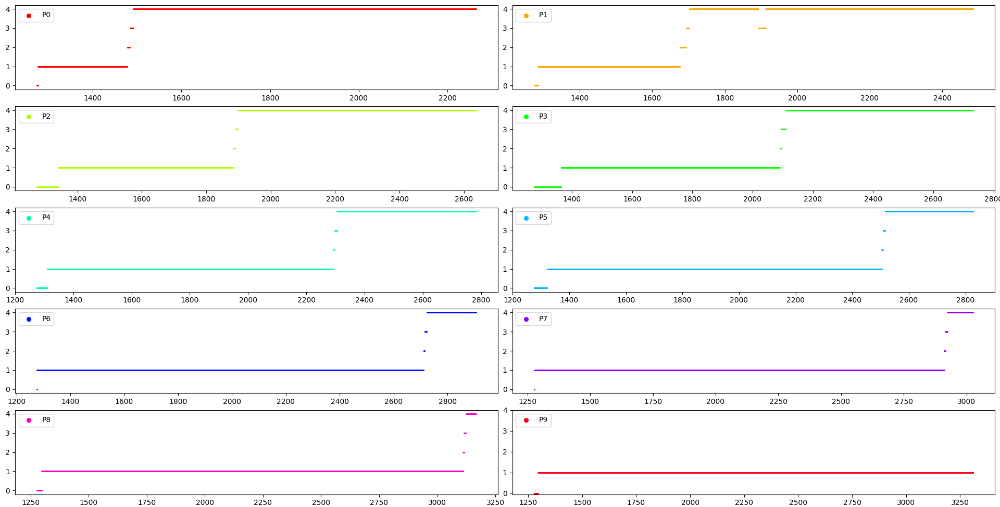
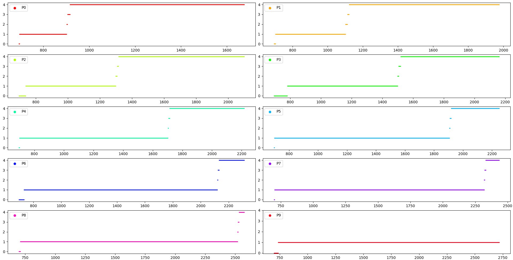

# Modified xv6 OS

## Sanchit Arora | 2019101047

---

## Running OS

1. Install qemu
2. From the root directory of project, run `make clean; make qemu-nox SCHEDULER={SCHEDULER}

- `SCHEDULER` can be one of the following:
  - `RR` (Round Robin) (Default)
  - `FCFS` (First Come First Serve)
  - `PBS` (Priority Based Scheduler)
  - `MLFQ` (Multi Level Feedback Queue)

## New Features Implemented

### waitx system call

- Creation time, end time, cpu running time and IO time have been added to proc structure
- A new system call `waitx` implemented which is just like `wait` but takes pointer to two integers as arguments
- Running time and waiting time is stored in the arguments given

### time command

- Prints the running and waiting time of the program given
- Uses `waitx` system call

### ps user program

- Uses `ps` system call
- Prints details about all processes like:
  - PID: PID of the process
  - Priority: Priority of process (only for PBS)
  - State: State of process- Running, Runnable, Sleeping, etc.
  - r_time: Ticks spent on running on CPU
  - w_time: Waiting time of process (reset when run or changes queue)
  - n_run: Number of times the process got to run on CPU
  - cur_q: Current queue (only for MLFQ)
  - q{i}: Ticks spent in each queue (only for MLFQ)

### set_priority system call & setPriority user program

- Only valid in case of Priority Based Scheduling (PBS)
- Used to set the priority of a process
- Priority should be between 0 and 100 (both inclusive)

### First Come First Serve (FCFS)

- Non-preemptive scheduling
- Always looks for process with lowest creation time

### Priority Based Scheduler (PBS)

- Preemptive scheduling
- Lower the value, higher the priority
- 101 queues are created for each priority levels
- Process gets popped from top priority queue and pushed back if runnable after a tick
- On changing priority (using `set_priority` system call or `setPriority` user program), the process is removed from it's queue and pushed in the required queue
- This results in Round Robin of processes of same priority

### Multi Level Feedback Queue (MLFQ)

- 5 queues are created
- Process in queue _i_ gets _2^i_ ticks to run
- If it's still Runnable, it gets demoted to lower priority (only if it's not already in the lowest)
- It's then pushed to the required queue (with same or lower priority)
- Starvation is handled by increasing the priority of process which neither got picked nor changed their queue in the last 50 ticks
- This results in a Round Robin for processes in the lowest priority queue
- **Exploitation:** A process can exploit this MLFQ algorithms by programming it to go to sleep (or IO) for a small time just before the maximum limit of top priority queue. This way, just because of large amount of IO bursts (though very small) it gets to stay on the top priority queue.

## Report

>All the results were generated using the benchmark program in `benchmark.c`. The results may vary depending on this.

## Total Time for each Scheduling Algorithm

The total time taken for all the child processes were tested on different scheduling algorithms and number of CPU.

- Number of CPU = 1

  FCFS took a long time whereas the other 3 (RR, PBS, MLFQ) were nearly same

- Number of CPU = 2

  Major decrease in time for FCFS (still more than other three). Minor change in time for other three algorithms

## Time spent on each queue in MLFQ

The graphs were plotted for all the 10 child processes for different aging times and number of CPU. Higer process number has higher IO bursts.

- Number of CPU = 1, Aging time = 35 ticks

- Number of CPU = 1, Aging time = 50 ticks

- Number of CPU = 2, Aging time = 35 ticks

- Number of CPU = 2, Aging time = 50 ticks

